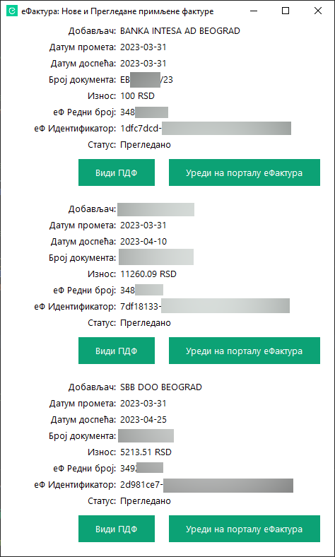

# еФактура: Нове примљене фактуре

Проверава и приказује информације о новим улазним фактурама са портала efaktura.mfin.gov.rs

Такође без потребе за пријављивањем на портал еФактура, добавља и локално чува у поддиректоријуму `efakture` ПДФ и ИксМЛ датотеке за сваку нову фактуру.

**НАПОМЕНА** Скрипта служи само за читање података са портала еФактура и не врши никакве измене на порталу. Уколико на порталу отворите фактуру која је означена као *Нова*, она ће аутоматски бити означена као *Прегледано* и више неће бити приказивана као нова.

# Неопходно за коришћење скрипта

Да би уопште могли да покренете скрипт `efaktura.pyw` неопходно је да на вашем рачунару имате инсталиран [Python 3](https://www.python.org/downloads/).

# Конфигурисање скрипта

1. Пријавите се својим налогом на портал https://efaktura.mfin.gov.rs/
2. У левом изборнику кликните на опцију **Подешавања**
3. Потом на десном панелу кликните на поље **API менаџмент**
4. На страници **API менаџмент** кликните на дугме за генерисање новог **Кључа за аутентификацију**. Уколико већ имате генерисан кључ, прескочите овај корак.
5. Након генерисања кључа поставите прекидач за **API статус** на **Активно** и ископирајте **Кључ за аутентификацију**
6. Отворите у уређивачу текста датотеку `config-sample.json` и замените текст **ТВОЈ_АПИ_КЉУЧ** са кључем који сте копирали у претходном кораку.
7. Сачувајте датотеку под новим називом `config.json`.

Након конфигурисања покрените `efaktura.pyw` двокликом на Виндоузу, или покретањем команде у терминалу:

`python efaktura.pyw`
